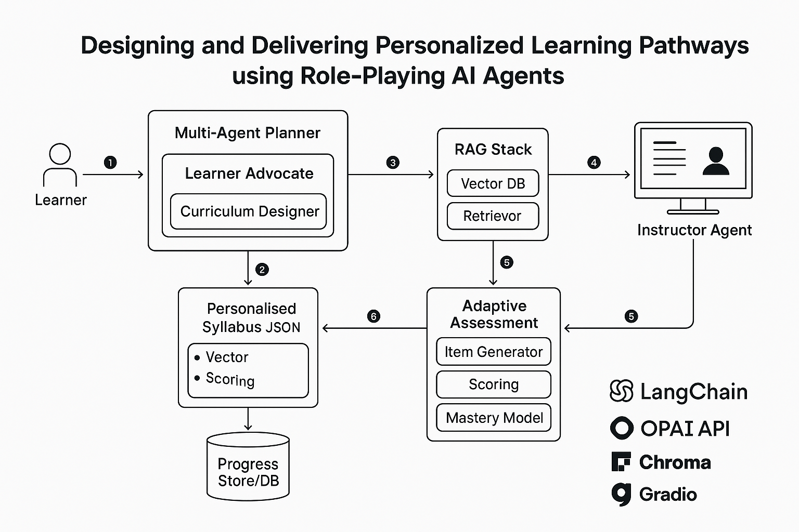

# EduGPT-PersonalisedLearning  
**MSc Project: Designing and Delivering Personalised Learning Pathways using Role-Playing AI Agents**  

This project extends the [EduGPT](https://github.com/hqanhh/EduGPT) framework to design and evaluate an AI-powered personalised learning system. The aim is to create a multi-agent “AI Educator” that can:  
1. Generate a personalised syllabus from learner goals using role-playing agents.  
2. Deliver lessons through an instructor agent with **retrieval-augmented generation (RAG)** for grounded, source-based teaching.  
3. Provide **adaptive assessment** that adjusts difficulty and pacing based on learner performance.  
4. Maintain a learner model to track mastery and guide ongoing pathway adaptation.  


## ✨ Features (Implemented)
- **Multi-Agent Syllabus Planner** – Learner advocate + curriculum designer agents negotiate and output a structured, validated syllabus with prerequisite checking.
- **Retrieval-Augmented Teaching** – RAG instructor agent delivers lessons using external resources with source citations and context-grounded responses.
- **Adaptive Assessment System** – Dynamic difficulty adjustment, points-weighted scoring, and LLM-based grading for open-ended questions.
- **Learner Profile & Progress Tracking** – Dynamic learner model with mastery levels, knowledge state, and performance analytics.
- **Session State Management** – Persistent session tracking with atomic file writes, pathway navigation (advance/remediation), and resume capability.
- **Production-Ready Infrastructure** – Schema validation, configuration management, comprehensive error handling, and 185+ unit tests.  

## System Architecture
The diagram below shows the overall workflow of the AI Educator system, from learner input through syllabus generation, lesson delivery with retrieval-augmented generation, adaptive assessment, and continuous feedback loops.  



## 🚀 Getting Started  

### 1. Clone the repository  
```bash
git clone https://github.com/anasraza57/EduGPT-PersonalisedLearning.git
cd EduGPT-PersonalisedLearning
```

### 2. Set up a virtual environment
```bash
# Create and activate virtual environment
python3 -m venv .venv
source .venv/bin/activate  # On Windows: .venv\Scripts\activate

# Install dependencies
pip install -r requirements.txt
```

### 3. Configure API keys
Create a `.env` file in the root directory and add:
```bash
OPENAI_API_KEY=your_key_here
```

### 4. Run the interactive demo
```bash
python src/run.py
```

This launches a Gradio web interface at `http://127.0.0.1:7860` with 5 tabs:
- **Tab 1**: Create learner profile
- **Tab 2**: Generate personalized syllabus
- **Tab 3**: Interactive teaching with RAG
- **Tab 4**: Adaptive assessment
- **Tab 5**: Progress tracking & analytics


## 📖 Background
- **EduGPT**: A LangChain-based project where a learner and instructor agent role-play to generate a syllabus and deliver lessons.

- **EduGPT-PersonalisedLearning**: This fork extends EduGPT with retrieval grounding, adaptive assessment, and learner modelling to deliver a production-ready personalised learning experience.

## 🏗️ Implementation Status

### ✅ Phase 1: Configuration & Validation
- Production configuration system with environment-based settings
- JSON Schema validation for all data models
- Comprehensive error handling and logging
- **Tests**: 20+ tests covering config loading and schema validation

### ✅ Phase 2: Learner Model
- Dynamic learner profile with goals, interests, prior knowledge
- Mastery tracking with concept-level granularity
- Progress analytics and adaptive difficulty recommendations
- **Tests**: 35+ tests for profile validation and analytics

### ✅ Phase 3: RAG Instructor
- **Automatic Multi-Source OER Content Fetching**:
  - Wikipedia articles for general knowledge
  - arXiv research papers for technical/scientific topics
  - YouTube video transcripts (optional)
  - AI-generated synthetic content as fallback
- Document ingestion with vector embeddings (ChromaDB)
- Context-aware lesson delivery with source citations
- Session persistence and teaching state management
- **Tests**: 40+ tests for retrieval, citation tracking, session handling, and OER fetching
- **See**: [OER Sources Documentation](docs/OER_SOURCES.md) for detailed information

### ✅ Phase 4: Adaptive Assessment
- Multi-difficulty question generation aligned with learning objectives
- Points-weighted scoring system for nuanced difficulty
- LLM-based grading for open-ended responses with detailed feedback
- Adaptive quiz sessions with real-time difficulty adjustment
- **Tests**: 55+ tests for generation, grading, and adaptive logic

### ✅ Phase 5: Orchestrator & Integration
- Complete learning pipeline from enrollment to completion
- Session state management with atomic persistence
- Pathway navigation (advance on success, remediate on failure)
- Citation and metrics tracking across teaching/assessment cycles
- Multi-agent syllabus planning with prerequisite validation
- **Tests**: 35+ tests for orchestration, integration, and end-to-end workflows

**Total Test Coverage**: 185+ unit tests, all passing ✅

## 📂 Project Structure

```
EduGPT-PersonalisedLearning/
├── src/
│   ├── agents/               # AI agents for teaching & assessment
│   │   ├── syllabus_planner.py     # Multi-agent syllabus generation
│   │   ├── rag_instructor.py       # RAG-based teaching agent
│   │   ├── assessment_generator.py # Adaptive question generation
│   │   └── grading_agent.py        # LLM-based grading
│   ├── models/               # Data models & state management
│   │   ├── learner_profile.py      # Learner model with mastery tracking
│   │   └── quiz_session.py         # Adaptive quiz state management
│   ├── utils/                # Utilities & infrastructure
│   │   ├── config.py               # Configuration management
│   │   └── validation.py           # JSON Schema validation
│   ├── orchestrator.py       # Main pipeline orchestration
│   └── run.py                # Entry point
├── tests/
│   └── unit/                 # Comprehensive unit test suite
│       ├── test_config.py
│       ├── test_validation.py
│       ├── test_learner_model.py
│       ├── test_rag_instructor.py
│       ├── test_assessment_generator.py
│       ├── test_grading_agent.py
│       ├── test_quiz_session.py
│       ├── test_orchestrator.py
│       └── test_syllabus_planner.py
├── data/                     # Runtime data storage
│   ├── sessions/             # Session state persistence
│   └── learner_profiles/     # Learner profile storage
├── schemas/                  # JSON Schema definitions
├── requirements.txt
└── README.md
```

## 🧪 Testing

### Run All Tests
```bash
python -m unittest discover tests/unit -v
```

### Quick Test Suite (Recommended)
Run fast tests only:
```bash
pytest tests/unit/test_config.py tests/unit/test_validation.py tests/unit/test_learner_profile_validation.py tests/unit/test_rag_instructor.py tests/unit/test_assessment_generator.py tests/unit/test_grading_agent.py tests/unit/test_quiz_session.py tests/unit/test_assessment_schemas.py tests/unit/test_orchestrator.py tests/unit/test_syllabus_planner.py --no-cov -q
```
**Result:** 185+ tests pass in < 3 seconds ✅

### Test Coverage
- **Configuration & Validation**: `test_config.py`, `test_validation.py`
- **Learner Profile**: `test_learner_model.py`, `test_learner_profile_validation.py`
- **RAG Instructor**: `test_rag_instructor.py`
- **Assessment System**:
  - `test_assessment_generator.py` - Question generation and validation
  - `test_grading_agent.py` - LLM-based grading for open-ended responses
  - `test_quiz_session.py` - Adaptive quiz and points-weighted scoring
  - `test_assessment_schemas.py` - Schema validation for assessments and quiz sessions
- **Orchestration & Integration**:
  - `test_orchestrator.py` - Complete pipeline orchestration
  - `test_syllabus_planner.py` - Multi-agent syllabus generation

### Run Specific Test Suites
```bash
# Learner profile tests
python -m unittest tests.unit.test_learner_model -v

# Assessment system tests
python -m unittest tests.unit.test_assessment_generator -v
python -m unittest tests.unit.test_grading_agent -v
python -m unittest tests.unit.test_quiz_session -v

# Schema validation tests
python -m unittest tests.unit.test_assessment_schemas -v
```
